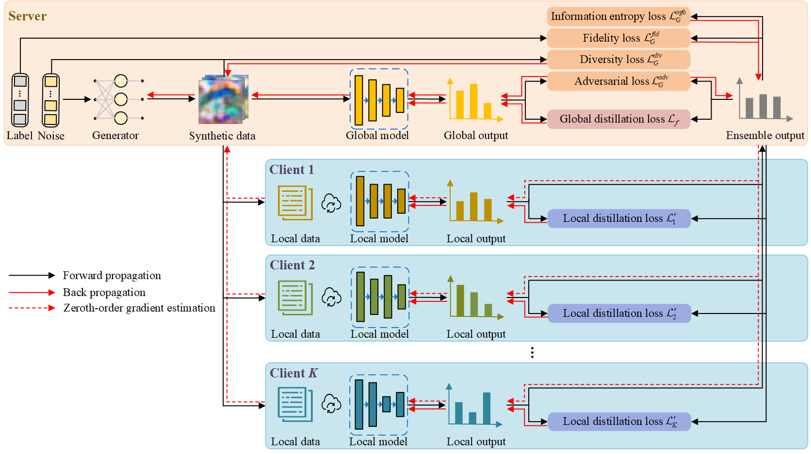

This repository contains an implementation with PyTorch for the paper "**Data-Free Black-Box Federated Learning via Zeroth-Order Gradient Estimation**". The figure below illustrates an overview of the FedZGE framework.



For more details about the technical details of FedZGE, please refer to our paper.

**Installation**

Run command below to install the environment (using python3):

```
pip install -r requirements.txt
```

**Usage**

Run command below to run experiments on the homogeneous FL setting :

```
# CIFAR-10
python main.py \
  --seed 0 \  # 0, 1, 2
  --algorithm FedZGE \
  --dataset cifar10 \
  --data_dir ./data \
  --partition dirichlet \
  --alpha 1 \  # 1, 0.1
  --batch_size 256
  --K 10 \
  --C 1 \
  --R 100 \
  --E1 10 \
  --E2 10 \
  --E3 10 \
  --lr_k 0.01 \
  --lr 0.01 \
  --lr_G 0.001 \
  --dis_epochs 3 \
  --dis_lr 2e-5
  --synthetic_size 500 \
  --nz 100 \
  --temperature 5 \
  --beta1 1 \
  --beta2 1 \
  --beta3 1 \
  --q 5 \
  --eps 0.001 \
  --central_model resnet18 \  # resnet18, resnet34, resnet50
  --local_models resnet18 \  # resnet18, resnet34, resnet50
  --optimizer adam \
  --scheduler cosine \
  --output_dir ./runs \
  
# CIFAR-100
python main.py \
  --seed 0 \  # 0, 1, 2
  --algorithm FedZGE \
  --dataset cifar100 \
  --data_dir ./data \
  --partition dirichlet \
  --alpha 1 \  # 1, 0.1
  --batch_size 256
  --K 10 \
  --C 1 \
  --R 100 \
  --E1 10 \
  --E2 10 \
  --E3 10 \
  --lr_k 0.01 \
  --lr 0.01 \
  --lr_G 0.001 \
  --dis_epochs 3 \
  --dis_lr 2e-5
  --synthetic_size 500 \
  --nz 100 \
  --temperature 5 \
  --beta1 1 \
  --beta2 1 \
  --beta3 1 \
  --q 5 \
  --eps 0.001 \
  --central_model resnet18 \  # resnet18, resnet34, resnet50
  --local_models resnet18 \  # resnet18, resnet34, resnet50
  --optimizer adam \
  --scheduler cosine \
  --output_dir ./runs \
```

Run command below to run experiments on the heterogeneous FL setting :

```
# CIFAR-10
python main.py \
  --seed 0 \  # 0, 1, 2
  --algorithm FedZGE \
  --dataset cifar10 \
  --data_dir ./data \
  --partition dirichlet \
  --alpha 1 \  # 1, 0.1
  --batch_size 256
  --K 10 \
  --C 1 \
  --R 100 \
  --E1 10 \
  --E2 10 \
  --E3 10 \
  --lr_k 0.01 \
  --lr 0.01 \
  --lr_G 0.001 \
  --dis_epochs 3 \
  --dis_lr 2e-5
  --synthetic_size 500 \
  --nz 100 \
  --temperature 5 \
  --beta1 1 \
  --beta2 1 \
  --beta3 1 \
  --q 5 \
  --eps 0.001 \
  --central_model resnet50 \
  --local_models resnet18,resnet18,resnet18,resnet34,resnet34,resnet34,resnet50,resnet50,resnet50,resnet50 \
  --optimizer adam \
  --scheduler cosine \
  --output_dir ./runs \
  
# CIFAR-100
python main.py \
  --seed 0 \  # 0, 1, 2
  --algorithm FedZGE \
  --dataset cifar100 \
  --data_dir ./data \
  --partition dirichlet \
  --alpha 1 \  # 1, 0.1
  --batch_size 256
  --K 10 \
  --C 1 \
  --R 100 \
  --E1 10 \
  --E2 10 \
  --E3 10 \
  --lr_k 0.01 \
  --lr 0.01 \
  --lr_G 0.001 \
  --dis_epochs 3 \
  --dis_lr 2e-5
  --synthetic_size 500 \
  --nz 100 \
  --temperature 5 \
  --beta1 1 \
  --beta2 1 \
  --beta3 1 \
  --q 5 \
  --eps 0.001 \
  --central_model resnet50 \
  --local_models resnet18,resnet18,resnet18,resnet34,resnet34,resnet34,resnet50,resnet50,resnet50,resnet50 \
  --optimizer adam \
  --scheduler cosine \
  --output_dir ./runs \
```

